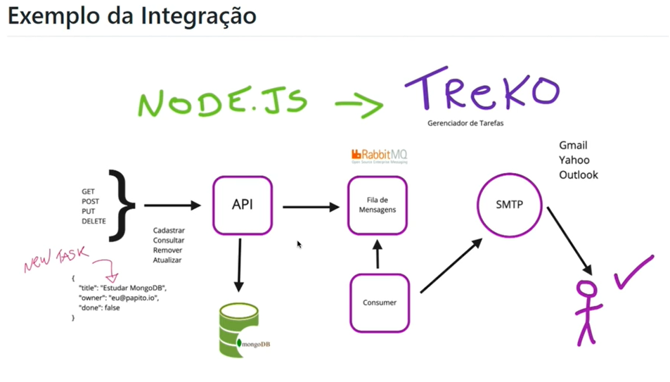

# Test-mocha.js-chai.js

**Testes APIs - Microserviço com Node.js**

Automação de Teste, utilizando o mocha.js um framework para trabalhar com testes no node.

**Técnicas de testes**

O projeto de teste apresenta as seguintes tecnologias:

| Recurso                                                        | Tecnologia                                                 |
| -------------------------------------------------------------- | ---------------------------------------------------------- |
| **SO**                                                   | *Windows 10*                                             |
| **Ferramenta empacotamentoe execução da aplicações** | *Docker*                                                 |
| **Biblioteca de testes de aceitação**                  | *Chaijs*                                                 |
| **BDD testes de negócio**                               |                                                            |
| **TDD testes de desenvolvimento**                        | *Mochajs*                                                |
| **Desing Patterns**                                      |                                                            |
| **Page Objects**                                         |                                                            |
| **Back-end**                                             | *[Treko](https://github.com/qaninja-academy/treko "Back-end")* |
| **Banco Dados**                                          | *MongoDB*                                                |
| **Gerenciador BD**                                       | *[Robo Mongo](https://robomongo.org/ "Gerenciador de BD")*     |
| **Serviço Mensageria(service Brocker)**                 | *RabbitMQ*                                               |

### Installation

* [Site Mocha.js](https://mochajs.org "Documentation")
* [Site chai.js](https://www.chaijs.com "Documetation")
* [Plugin Chai.js](https://www.chaijs.com/plugins/chai-http "Plugin")

Install Mocha.js;

* Install Mocha.js

```shell
npm install --save-dev mocha
```

* Install Chai.js

```shell
npm install chai --save
```

* Install ChaiHTTP

```shell
npm install chai-http --save
```

* Install Container Mongo

```shell
docker run --name mongo -d -p 27017:27017 mongo
```

* Install RabbitMQ: http://localhost:15672/ **user**: guest **senha**: guest

```shell
docker run -d --hostname rabbitmq --name rabbitmq -p 15672:15672 -p 5672:5672 -p 25676:25676 rabbitmq:3-managementan
```


* Running project

| Action             | Usage                  |
| ------------------ | ---------------------- |
| Criar Project Node | ***npm init*** |
| Rodar API          | ***npm start***      |
| Running unit tests | ***npm test*** |
|                    |                        |
|                    |                        |
|                    |                        |

### Clone the repo

```shell
$ git clone https://github.com/portifolio-qa/Test-mocha.js-chai.js.git
```

### Author

Rose Dias

## Info Basic mocha.js

* Possui uma sintaxe parecida com o ruby/rspec;

```
describe('Suite', function(){
  it('Test', function(){
    console.log('Teste')
  
  });
  
});
```

* ***Mocha:*** Framework de teste unitário, pode ser utilizado do lado servidor com o Node ou no lado do cliente, ele apenas monta a estrutura para criar os testes, para realizar validações, verificações, asserções é necessário utilizar um framework ;
* **Chais.js:** É uma biblioteca de asserções,  dá a possibilidade de utilizar BDD e TDD, lembrando que não é o cucumber, é possivel utilizar com Should, Expect e Assert, ambas são iguais, o que muda é a sintaxe. Nesse projeto utilizarmos  o expect para seguirmos o padrão do rspec e por ser o mais utilizado na comunidade de testes.
* **ChaiHTTP:** Framework que irá acessar a api, para realizar as requisições nas api, como get, post etc, o node possui diversas ferramentas para testar requisições, aqui poderiamos utilizar o jest também;


## Info Basic RabbitMQ

É um serviço de mensageria, que utiliza o protocolo AMQP (Advanced Message Queuing Protocol), utilizado para envio de mensagens (notificações), para que o consumer que é outro software faça uma ação, permite também trabalhar com envio de mensagem assíncrono.

Fluxo: Sempre que houver um cadastro de uma nova tarefa a api avisa o rabbit que foi cadastrada uma nova tarefa para tal usuário, após o consumer que estiver escrito nessa fila, vai ler a informação e tomar a ação, por exemplo de enviar o e-mail para o dono da tarefa que é o usuário que foi cadastrado na api.

Nessa arquitetura de microserviços a api somente possui responsabilidade de Get, Post, Put e Delete e notificar o tipo de operação (para o RabbitMQ), o consumer após ler as mensagens toma a ação de enviar o e-mail e comunicar o usuário que está cadastrado na api.


